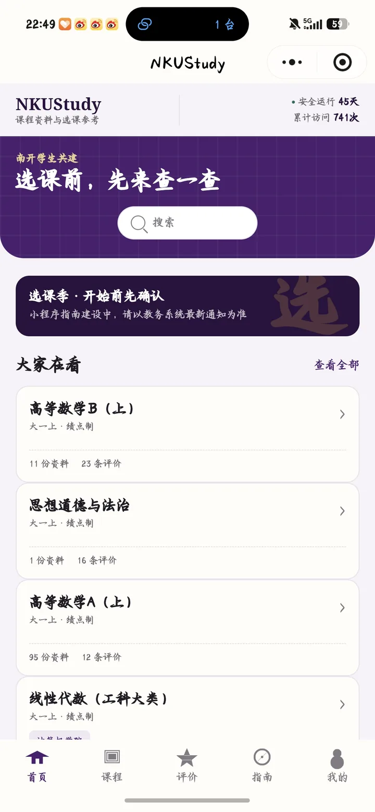
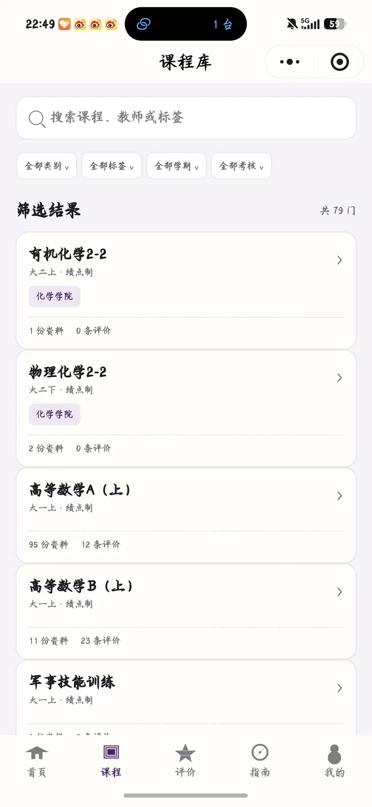
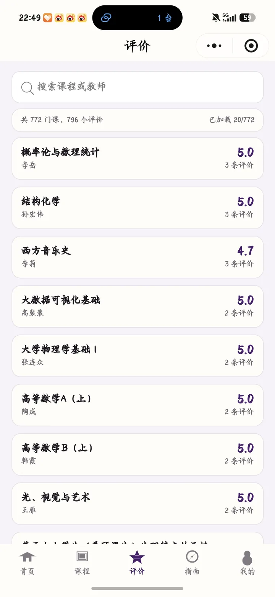
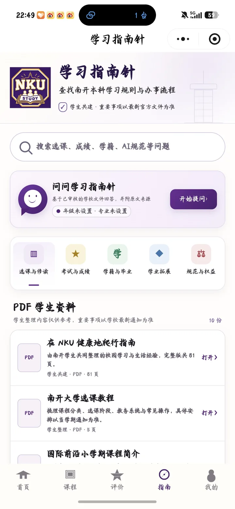
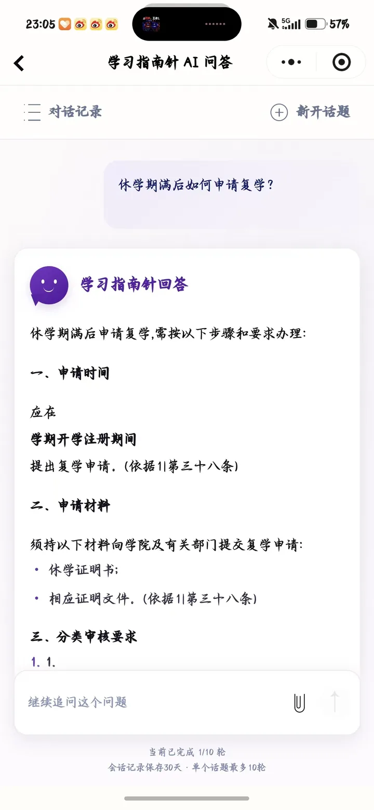
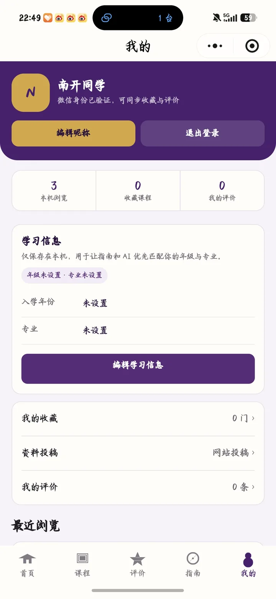

<div align="center">

# 🎓 NKUStudy 微信小程序

**南开学生共建的课程资料、选课参考与学习指南平台**

把分散的课程信息、同学评价、学习资料和校内办事指南，整理成一个随时可查的小程序。📚

[](#-快速开始)
[](./package.json)
[](https://nkustudy.top)
[](./LICENSE)

[🌐 访问 NKUStudy](https://nkustudy.top) · [📖 API 契约](./docs/API.md) · [✅ 验收清单](./docs/ACCEPTANCE.md) · [🤝 协作计划](./docs/COLLABORATION_PLAN.md)

</div>

> [!IMPORTANT]
> NKUStudy 是学生共建的非官方项目。课程安排、考试与成绩、学籍、转专业等重要事项，请始终以南开大学及相关部门发布的最新文件为准。

## 👋 一句话认识我们

NKUStudy 希望解决一个很朴素的问题：**同学真正需要的信息，不该散落在多个网页、群聊和文件夹里。**

这个仓库提供原生微信小程序客户端，围绕“查课程、看评价、找资料、读指南、问问题”构建统一体验。生产课程、教师、资料、评价和指南由 NKUStudy 网站服务维护；小程序只读取公开业务接口，不复制第二套生产内容，也不提供后台管理能力。

## ✨ 你可以用它做什么

| 场景 | 能力 | 说明 |
|---|---|---|
| 🏠 首页速览 | 热门课程、最近更新、站点运行状态 | 快速了解平台内容与近期变化 |
| 🔎 一站式搜索 | 课程、教师、资料、指南四类搜索 | 无课程筛选时，本地检索同一份版本化搜索快照 |
| 📚 课程查询 | 学期、课程组、标签、考核方式筛选 | 查看课程详情、教师安排、资料和评价 |
| ⭐ 课程收藏 | 收藏与取消收藏 | 登录后通过服务器同步，不影响匿名浏览 |
| 💬 评价社区 | 课程/教师模糊搜索、评价分组、匿名投稿 | 已登录投稿仍按匿名规则公开，同时可查看本人审核状态 |
| 🧭 学习指南针 | 五分类指南、章节导航、学院 variant | 覆盖选课、成绩、学籍毕业、发展规划、规则权益 |
| 🤖 指南针 AI | 多轮问答、引用原文、拒答与恢复状态 | 基于已审核材料回答；客户端已接入正式接口，实际可用性取决于生产配置与登录状态 |
| 📄 资料阅读 | R2 文件下载并调用微信文档阅读器 | 仅接受指定 HTTPS 资源域名，支持 PDF、DOC、DOCX |
| 👤 个人中心 | 微信登录、昵称、收藏、评价、反馈 | Token 仅保存在微信本地，401 或过期后立即清除 |

## 📱 界面预览

<table>
  <tr>
    <td align="center" width="33%">
      <strong>🏠 首页</strong><br />
      <sub>热门课程、最近更新与站点状态</sub>
    </td>
    <td align="center" width="33%">
      <strong>📚 课程</strong><br />
      <sub>组合筛选、分页与课程详情入口</sub>
    </td>
    <td align="center" width="33%">
      <strong>💬 评价</strong><br />
      <sub>按课程和教师查找真实评价分组</sub>
    </td>
  </tr>
  <tr>
    <td align="center"></td>
    <td align="center"></td>
    <td align="center"></td>
  </tr>
  <tr>
    <td align="center" width="33%">
      <strong>🧭 学习指南针</strong><br />
      <sub>五分类制度指南与学生资料</sub>
    </td>
    <td align="center" width="33%">
      <strong>🤖 指南针 AI</strong><br />
      <sub>带原文依据的多轮学习问答</sub>
    </td>
    <td align="center" width="33%">
      <strong>👤 我的</strong><br />
      <sub>收藏、评价、反馈与本机学习信息</sub>
    </td>
  </tr>
  <tr>
    <td align="center"></td>
    <td align="center"></td>
    <td align="center"></td>
  </tr>
</table>

<div align="center">
  <sub>截图为实际小程序界面示例；内容与统计会随生产数据更新。✨</sub>
</div>

## 🧭 学习指南针

学习指南针不是简单的文章列表，而是一套面向学生任务的内容体系：

- **18 篇生产指南**：覆盖五个一级分类，当前数量为 `3 / 3 / 4 / 5 / 3`。
- **29 个学院 variant**：转专业等场景按学院按需加载，校级规则和学院要求分开展示。
- **结构化正文**：支持章节、列表、表格、引用、来源卡片和章节导航。
- **可信原件**：生产来源只接受 `resources.nkustudy.top/guide-sources/` 下的公开文件。
- **就地纠错**：指南页可以提交带指南、章节和来源上下文的反馈，不必离开当前页面。
- **AI 问答**：最多完成 10 轮对话，使用最近 9 轮历史，可结合本机保存的入学年份和专业。
- **诚实拒答**：证据不足或来源冲突时明确拒答，不用模型记忆补造制度结论。

当前客户端已经完成 production AI 接线，但“客户端接好”不等于“正式发布全部完成”。模型配置、30 题真实评测、微信合法域名、真实账号登录、真机与体验版冒烟等上线条件，请查看[学习指南针最终生产验收交接](./docs/LEARNING_COMPASS_PRODUCTION_ACCEPTANCE_HANDOFF.md)。

## 🏗️ 项目架构

```text
微信小程序客户端
├─ 页面与组件：miniprogram/pages + miniprogram/components
├─ 通用公开 API：miniprogram/services/public-api.js
├─ 学习指南针 API：miniprogram/features/learning-compass/api.js
├─ 登录会话：微信本地存储中的 Bearer Token
└─ 资源打开器：downloadFile → openDocument
       │
       ├─ https://nkustudy.top/api/v1
       │    ├─ 课程 / 搜索 / 评价 / 收藏
       │    └─ 指南 / 学院 variant / AI 问答
       │
       └─ https://resources.nkustudy.top
            └─ 课程资源与指南原件
```

### 数据边界

- 内容管理继续由网站后台负责，小程序不会调用 `/admin-api/*`。
- 课程 ID、评价分组键、指南 ID 和 variant ID 均使用服务器稳定标识。
- 小程序不保存服务器密码、微信 AppSecret、OpenID、R2 密钥、模型密钥或管理 Cookie。
- 动态下载地址必须是 HTTPS，且主机严格匹配允许的资源域名。
- 网络、权限和服务错误会映射为用户可恢复的页面状态，不直接暴露 provider、内部路径、Token 或堆栈。

## 🚀 快速开始

### 环境要求

- [Node.js](https://nodejs.org/) `>= 18`
- npm
- 微信开发者工具
- 已获得仓库代码和合法的小程序开发权限

### 本地运行

```powershell
git clone https://github.com/mzk-C4/NKU-study-wxapp.git
cd NKU-study-wxapp
npm ci
npm test
npm run devtools:open
```

仓库已经包含 `project.config.json`，小程序根目录为 `miniprogram/`。`devtools:open` 会调用微信开发者工具 CLI 打开当前项目；首次使用时仍需要在开发者工具中完成登录与授权。

### API profile

| 微信环境 | 默认 profile | API 地址 |
|---|---|---|
| develop | production | `https://nkustudy.top/api/v1` |
| trial | production（强制） | `https://nkustudy.top/api/v1` |
| release | production（强制） | `https://nkustudy.top/api/v1` |

只有 `develop` 环境可以显式切换到固定的本地 reference 服务：

```javascript
wx.setStorageSync('nkustudy_api_profile', 'reference')
```

切换后重新编译。验收生产环境前请移除这个键：

```javascript
wx.removeStorageSync('nkustudy_api_profile')
```

客户端不接受任意 URL、IP 或协议覆盖，体验版和正式版也不会读取 reference 配置。

## 🧪 质量检查

| 命令 | 用途 |
|---|---|
| `npm test` | 契约、页面状态、搜索/指南、内容、学习指南针与静态门禁 |
| `npm run check:miniprogram` | 页面注册、组件引用、JS 语法、接口所有权和秘密模式检查 |
| `python scripts/check-wxml.py` | 扫描 WXML 结构与常见模板错误 |
| `npm run release:check` | 在完整本地检查后执行只读生产 `/home` 预检 |
| `npm run devtools:preview` | 生成微信开发者工具预览 |
| `npm run devtools:upload` | 通过发布检查后调用开发者工具上传 |

自动化通过仍不能替代微信开发者工具、真机、小屏、大字体、体验版和真实生产登录验收。发布前请逐项完成 [`docs/ACCEPTANCE.md`](./docs/ACCEPTANCE.md)。

## 🌐 微信合法域名

| 类型 | HTTPS 域名 | 用途 |
|---|---|---|
| request | `https://nkustudy.top` | 公开 API、反馈与匿名站点统计 |
| downloadFile | `https://resources.nkustudy.top` | 课程资料和指南原件 |

`project.config.json` 保持 `urlCheck: true`。开发者工具遇到 404 或网络错误时，客户端不会静默回退到旧服务或伪造本地生产数据。

## 📂 目录结构

```text
NKU-study-wxapp/
├─ miniprogram/              # 原生微信小程序客户端
│  ├─ components/            # 复用组件
│  ├─ features/              # 学习指南针等领域模块
│  ├─ pages/                 # 页面与 Tab
│  ├─ services/              # 通用公开 API adapter
│  └─ utils/                 # 请求、会话、Markdown、搜索等工具
├─ docs/                     # 契约、验收、交接和协作记录
│  └─ assets/readme/         # README 界面截图
├─ scripts/                  # 静态检查、预检与开发者工具脚本
├─ test/                     # Node.js 自动化测试
├─ design/                   # 设计材料
├─ project.config.json       # 微信开发者工具项目配置
└─ package.json              # 本地命令与质量门禁
```

## 🤝 参与共建

欢迎提交课程体验、界面改进、可访问性、测试、文档和指南内容方面的贡献。建议流程：

1. 先阅读 [`AGENTS.md`](./AGENTS.md)、[`docs/API.md`](./docs/API.md) 与 [`docs/COLLABORATION_PLAN.md`](./docs/COLLABORATION_PLAN.md)。
2. 从最新 `main` 创建目标单一的功能分支。
3. 保留加载、空数据、错误、重试和无权限状态，不恢复旧接口或本地假数据。
4. 为行为变化补充测试，并运行 `npm test` 与 WXML 检查。
5. 提交 PR，说明改动范围、验证证据、尚未执行的人工检查和潜在风险。

当前页面鸣谢：**马兆坤、南开指南针、Shview、洪修睿、丁宇鑫**。谢谢每一位提交资料、评价、反馈和代码的同学。💜

## 🗺️ 当前边界

为了让功能描述保持诚实，以下能力不会由客户端自行补造：

- 不使用微信手机号授权。
- 不开放管理接口，也不在仓库保存生产凭据。
- 资料文件投稿继续引导至网站入口，不调用未开放的上传接口。
- 不调用资源举报、独立资源详情或旧课程评价接口。
- AI 遇到证据不足、来源冲突、未登录、限流或服务不可用时展示明确状态。
- 学生整理内容只作参考，重要事项必须回到最新官方文件确认。

## 📚 延伸文档

- [`docs/API.md`](./docs/API.md)：正式公开 API、字段、认证和安全边界
- [`docs/DATA_MAPPING.md`](./docs/DATA_MAPPING.md)：服务器 DTO 与客户端展示映射
- [`docs/ACCEPTANCE.md`](./docs/ACCEPTANCE.md)：当前阶段发布验收清单
- [`docs/LEARNING_COMPASS_RELEASE_HANDOFF.md`](./docs/LEARNING_COMPASS_RELEASE_HANDOFF.md)：学习指南针客户端发布交接
- [`docs/LEARNING_COMPASS_PRODUCTION_ACCEPTANCE_HANDOFF.md`](./docs/LEARNING_COMPASS_PRODUCTION_ACCEPTANCE_HANDOFF.md)：生产 AI 与指南最终验收条件
- [`docs/COLLABORATION_PLAN.md`](./docs/COLLABORATION_PLAN.md)：协作事实、状态与完成定义

## 📜 开源许可

本项目使用 [MIT License](./LICENSE)。欢迎在遵守许可的前提下学习、改进和共建。

<div align="center">

**愿每一次选课、查资料和找规则，都少一点信息差。🌱**

</div>
