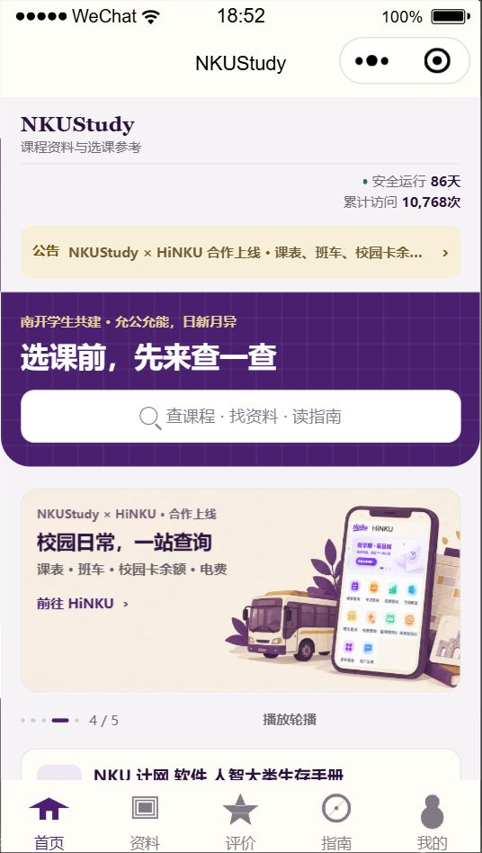
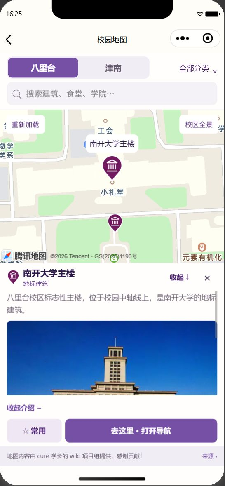
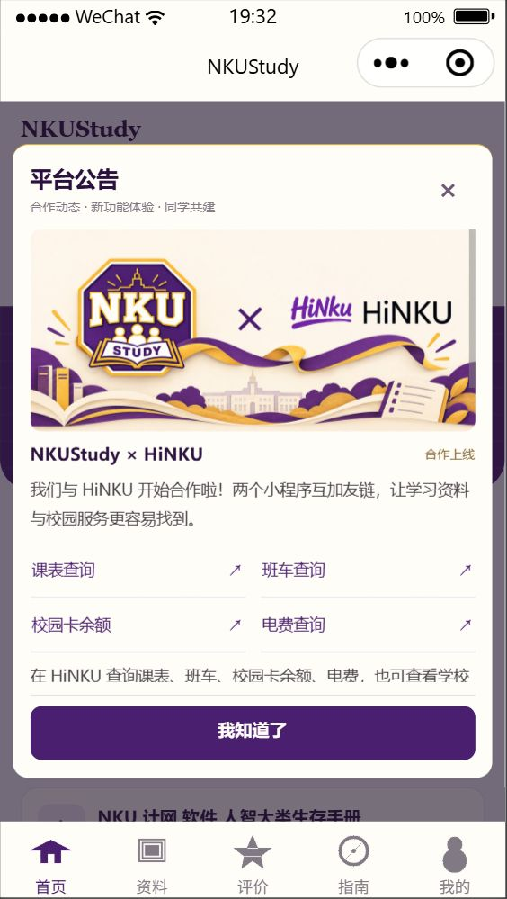

<div align="center">

# 🎓 NKUStudy 微信小程序

**以选课参考与课程资料为核心的南开学生共建平台**

把分散的课程信息、同学评价、学习资料和校内办事指南，整理成一个随时可查的小程序。📚

💜 允公允能，日新月异 · 查课程、看评价、找资料，少一点信息差。

[](#-快速开始)
[](./package.json)
[](https://nkustudy.top)
[](https://github.com/mzk-C4/NKU-study-wxapp/actions/workflows/ci.yml)
[](./LICENSE)

[🌐 访问 NKUStudy](https://nkustudy.top) · [📖 API 契约](./docs/API.md) · [✅ 验收清单](./docs/ACCEPTANCE.md) · [🤝 协作计划](./docs/COLLABORATION_PLAN.md)

</div>

> [!IMPORTANT]
> NKUStudy 是学生共建的非官方项目。课程安排、考试与成绩、学籍、转专业等重要事项，请始终以南开大学及相关部门发布的最新文件为准。

## 👋 一句话认识我们

NKUStudy 希望解决一个很朴素的问题：**同学真正需要的信息，不该散落在多个网页、群聊和文件夹里。**

这个仓库提供原生微信小程序客户端，围绕“查课程、看评价、找资料、读指南”构建统一体验。生产课程、教师、资料、评价和指南由 NKUStudy 网站服务维护；小程序只读取公开业务接口，不复制第二套生产内容，也不提供后台管理能力。

## 🆕 当前源码更新 · 2026-10-09

- **资料入口恢复**：补齐资料详情路由，课程与资料 ID 正确编码；打开失败有明确重试提示，继续沿用原下载与文档阅读流程。
- **地图更好找、更好读**：八里台 42 处、津南 34 处，分类图标、名称搜索、常用/最近、可收起列表、展开图文、底图重载与导航入口；保留 NKUwiki 来源和 cure 学长项目组鸣谢。
- **NKUStudy × HiNKU**：首页五张轮播依次为资料、评价、指南、HiNKU、飞书内测群；图文公告与指南页也可进入 HiNKU。
- **首页更紧凑**：品牌与站点统计同排，搜索下方展示公告，再接轮播；合作公告支持正文滚动、原界面展开和内测群二维码原图查看。

> [!NOTE]
> README 描述当前仓库源码，不表示微信线上版本已经更新。GitHub 推送、开发版上传、微信审核与正式发布是不同步骤；本次 Git 交付不包含微信上传或发布。保留现有原生页面，不启用另行制作的 HTML 新视觉稿。

## ✨ 你可以用它做什么

| 场景 | 能力 | 说明 |
|---|---|---|
| 🏠 首页速览 | 校园风格轮播、公告、最近更新、站点运行状态 | 扩大后的图文公告包含合作说明与飞书内测群二维码，可查看并保存原图 |
| 🤝 合作友链 | 首页第四张轮播、合作公告、指南页校园服务入口 | 打开 HiNKU 正式版首页，再选择课表、班车、校园卡余额、电费等服务；不直达具体功能页 |
| 🔎 一站式搜索 | 四类搜索、可展开课程筛选、本机搜索历史 | 无课程筛选时本地检索同一快照；历史最多 10 条 |
| 📚 课程查询 | 学期、课程组、标签、考核方式筛选 | 查看课程详情、教师安排、资料和评价 |
| ⭐ 课程收藏 | 收藏与取消收藏 | 登录后通过服务器同步，不影响匿名浏览 |
| 🗺️ 校园地图 | 76 个点位、分类图标、搜索、可收起列表和图文详情、常用/最近、导航 | 常用与最近仅存本机，最近最多 12 处；主楼相关文章可复制到浏览器查看 |
| 💬 评价社区 | 课程/教师搜索、评价分组、登录后投稿、本人审核状态 | 不提供匿名投稿；身份与发布权限仍由服务端校验 |
| 🧭 学习指南针 | 四个展示主题、学校制度分类、章节导航、学院 variant、学生 PDF | 区分官方文件与学生经验，不把客户端主题当成 API 分类 |
| 📄 资料阅读 | 资料详情、下载进度、文档打开、重试与链接失效反馈 | 支持 PDF、DOC/DOCX、XLS/XLSX、PPT/PPTX；其他格式或预览失败提供转发/浏览器出口 |
| 👤 个人中心 | 微信登录、昵称、头像选择与保存、手机号验证入口、收藏、评价、反馈 | Token 仅保存在微信本地；联网、主体配置和实际权限需分别验收 |

📝 **写到一半也不怕丢**：评价按课程保存草稿，反馈支持普通表单与纠错预填分别保存。草稿按账号隔离，仅存本机；超过 7 天不再恢复，并在后续保存时清理。自动保存不代表自动投稿，仍需点击提交。

校园体验第一轮记录见 [💜 2026-10-02 修改日志](./docs/CHANGELOG_2026-10-02.md)；之后的地图、资料入口与合作公告更新，以 [当前协作与验收记录](./docs/COLLABORATION_PLAN.md) 为准。

校园地图数据与分类图标来源于 NKUwiki；贡献者、内容许可及同步方法见 [地图来源说明](./miniprogram/features/campus-map/SOURCE.md)。

## 📱 界面预览

以下是 **2026-10-08 微信开发者工具实测截图**，不是浏览器设计稿。展示合作轮播、原生地图和扩大后的图文公告；10 月 9 日首页统计与公告位置又作了紧凑调整，所以轮播截图顶部间距不代表最终布局。数据、访问量和服务内容会变化，截图不作为实时统计。

<table>
  <tr>
    <td align="center" width="33%">
      <strong>🤝 HiNKU 合作轮播</strong><br />
      <sub>第四页 · 原页面与统一校园风格</sub>
    </td>
    <td align="center" width="33%">
      <strong>🗺️ 原生校园地图</strong><br />
      <sub>分类图标、图文详情与导航</sub>
    </td>
    <td align="center" width="33%">
      <strong>📣 合作图文公告</strong><br />
      <sub>联合主视觉、服务说明与滚动正文</sub>
    </td>
  </tr>
  <tr>
    <td align="center"></td>
    <td align="center"></td>
    <td align="center"></td>
  </tr>
</table>

<div align="center">
  <sub>轮播中的校园服务插画是概念画；真实服务由 HiNKU 提供。模拟器截图不能替代手机端跳转和二维码识别验收。✨</sub>
</div>

## 📚 选课与资料怎么用

1. **查课程**：首页搜索课程或教师；也可进入「资料」Tab，按修读阶段、课程类别、标签与考核方式筛选。
2. **看参考**：进入课程概览，查看教师、课程说明和评价；同学经验只作参考，开课与选课安排以学校通知为准。
3. **找文件**：课程资料列表 → 资料详情 → 下载并打开。网络失败可重试；无法预览、其他格式或超大文件可按提示转发文件或复制链接到浏览器。
4. **留线索**：课程收藏登录后同步；搜索历史、地图常用/最近和表单草稿仅存在当前设备，不等同于云端收藏。

资料投稿仍前往 [网站参与页](https://nkustudy.top/participate/)；问题反馈在小程序「我的 → 意见反馈」提交。请勿为测试向生产提交空白或无意义内容。

## 🤝 学习资料 × 校园服务

NKUStudy 负责课程资料、选课参考、评价与学习指南；HiNKU 提供课表、班车、校园卡余额、电费、学校公告与场地预约等校园服务。当前入口统一打开对方正式版首页，再由同学选择所需服务，不承诺功能页直达或双方账号互通。

首页第五张轮播及公告中保留飞书内测群原始二维码。点击查看完整原图并保存后，到所属组织的飞书扫一扫从相册识别；仅限组织内部成员，不宣称微信扫码即可入群。

## 🧭 学习指南针

学习指南针不是简单的文章列表，而是一套面向学生任务的内容体系：

- **四个展示主题**：新生入学、学海无涯、在校生活、学长焚决；学校制度仍使用原有五个正式 API 分类，数量以线上目录为准。
- **学院 variant**：转专业等场景按学院按需加载，校级规则和学院要求分开展示，不跨学院复用正文。
- **结构化正文**：支持章节、列表、表格、引用、来源卡片和章节导航。
- **可信原件**：生产来源只接受 `resources.nkustudy.top/guide-sources/` 下的公开文件。
- **就地纠错**：指南页可以提交带指南、章节和来源上下文的反馈，不必离开当前页面。
- **指南搜索**：查找学校指南与学生 PDF 简介，支持分类、类型筛选和近义词匹配。

2026-09-26 起，当前工作区已按用户要求移除指南针 AI 卡片、搜索追问入口与页面路由，并停用客户端 AI 请求。普通指南与 PDF 阅读不受影响；历史实现保留供代码追溯，不打包发布。不删除用户本机历史记录，不修改生产后端。上传与真机验收状态以[协作记录](./docs/COLLABORATION_PLAN.md)为准。

## 🏗️ 项目架构

```text
微信小程序客户端
├─ 页面与组件：miniprogram/pages + miniprogram/components
├─ 通用公开 API：miniprogram/services/public-api.js
├─ 学习指南针 API：miniprogram/features/learning-compass/api.js
├─ 登录会话：微信本地存储中的 Bearer Token
└─ 资源打开器：downloadFile → openDocument
       │
       ├─ https://nkustudy.top/api/v1
       │    ├─ 课程 / 搜索 / 评价 / 收藏
       │    └─ 指南 / 学院 variant
       │
       └─ https://resources.nkustudy.top
            └─ 课程资源与指南原件
```

### 数据边界

- 内容管理继续由网站后台负责，小程序不会调用 `/admin-api/*`。
- 课程 ID、评价分组键、指南 ID 和 variant ID 均使用服务器稳定标识。
- 小程序不保存服务器密码、微信 AppSecret、OpenID、R2 密钥、模型密钥或管理 Cookie。
- 动态下载地址必须是 HTTPS，且主机严格匹配允许的资源域名。
- 网络、权限和服务错误会映射为用户可恢复的页面状态，不直接暴露 provider、内部路径、Token 或堆栈。

## 🚀 快速开始

### 环境要求

- [Node.js](https://nodejs.org/) `>= 18`
- npm
- 微信开发者工具
- 已获得仓库代码和合法的小程序开发权限

运行与常规测试无需地图 Key、CloudBase 或 `sharp`。地图分类图标已随源码提供；只有手动重新生成图标时，才需开发机提供 `sharp`，方法见 [地图来源与维护](./miniprogram/features/campus-map/SOURCE.md)。

### 本地运行

```powershell
git clone https://github.com/mzk-C4/NKU-study-wxapp.git
cd NKU-study-wxapp
npm ci
npm test
npm run devtools:open
```

仓库已经包含 `project.config.json`，小程序根目录为 `miniprogram/`。`devtools:open` 会调用微信开发者工具 CLI 打开当前项目；首次使用时仍需要在开发者工具中完成登录与授权。

### API profile

| 微信环境 | 默认 profile | API 地址 |
|---|---|---|
| develop | production | `https://nkustudy.top/api/v1` |
| trial | production（强制） | `https://nkustudy.top/api/v1` |
| release | production（强制） | `https://nkustudy.top/api/v1` |

只有 `develop` 环境可以显式切换到固定的本地 reference 服务：

```javascript
wx.setStorageSync('nkustudy_api_profile', 'reference')
```

切换后重新编译。验收生产环境前请移除这个键：

```javascript
wx.removeStorageSync('nkustudy_api_profile')
```

客户端不接受任意 URL、IP 或协议覆盖，体验版和正式版也不会读取 reference 配置。

## 🧪 质量检查

2026-10-09 本地执行 `npm test`：**310 / 310 通过**（契约 36、页面 112、搜索/指南 85、内容 27、学习指南针历史回归 50）；静态门禁为 **26 页面 / 5 Tab**。历史 AI 代码的回归测试通过不代表 AI 功能重新启用。

| 命令 | 用途 |
|---|---|
| `npm test` | 契约、页面状态、搜索/指南、内容、学习指南针与静态门禁 |
| `npm run check:miniprogram` | 页面注册、组件引用、JS 语法、接口所有权和秘密模式检查 |
| `python scripts/check-wxml.py miniprogram` | 扫描 WXML 结构与常见模板错误 |
| `npm run release:check` | 在完整本地检查后执行只读生产 `/home` 预检 |
| `npm run devtools:preview` | 生成微信开发者工具预览 |
| `npm run devtools:upload` | 通过发布检查后调用开发者工具上传 |

自动化通过仍不能替代微信开发者工具、真机、小屏、大字体、体验版和真实生产登录验收。发布前请逐项完成 [`docs/ACCEPTANCE.md`](./docs/ACCEPTANCE.md)。

## 🌐 微信合法域名

| 类型 | HTTPS 域名 | 用途 |
|---|---|---|
| request | `https://nkustudy.top` | 公开 API、反馈与匿名站点统计 |
| downloadFile | `https://resources.nkustudy.top` | 课程资料和指南原件 |
| uploadFile | `https://nkustudy.top` | 本人头像图片上传；需后台配置及隐私指引 |

网站参与页与 NKUCS.ICU 的 `web-view` 另需对应业务域名配置；不能用 request 或 downloadFile 合法域名代替。HiNKU 入口是跨小程序跳转，不是本项目的生产 API。

`project.config.json` 保持 `urlCheck: true`。开发者工具遇到 404 或网络错误时，客户端不会静默回退到旧服务或伪造本地生产数据。

## 📂 目录结构

```text
NKU-study-wxapp/
├─ miniprogram/              # 原生微信小程序客户端
│  ├─ components/            # 复用组件
│  ├─ features/              # 学习指南针等领域模块
│  ├─ pages/                 # 页面与 Tab
│  ├─ services/              # 通用公开 API adapter
│  └─ utils/                 # 请求、会话、Markdown、搜索等工具
├─ docs/                     # 契约、验收、交接和协作记录
│  ├─ assets/                # 已标注日期的真实模拟器截图
│  └─ licenses/              # 第三方许可原文
├─ scripts/                  # 静态检查、预检、开发者工具与地图手动同步
├─ test/                     # Node.js 自动化测试
├─ design/                   # 设计材料
├─ project.config.json       # 微信开发者工具项目配置
└─ package.json              # 本地命令与质量门禁
```

## 🤝 参与共建

欢迎提交课程体验、界面改进、可访问性、测试、文档和指南内容方面的贡献。建议流程：

1. 先阅读 [`AGENTS.md`](./AGENTS.md)、[`docs/API.md`](./docs/API.md) 与 [`docs/COLLABORATION_PLAN.md`](./docs/COLLABORATION_PLAN.md)。
2. 从最新 `main` 创建目标单一的功能分支。
3. 保留加载、空数据、错误、重试和无权限状态，不恢复旧接口或本地假数据。
4. 为行为变化补充测试，并运行 `npm test` 与 WXML 检查。
5. 提交 PR，说明改动范围、验证证据、尚未执行的人工检查和潜在风险。

当前页面鸣谢：**马兆坤、南开指南针、Shview、洪修睿、丁宇鑫、K、cure（nkuwiki合作方）、王绅右**。谢谢每一位提交资料、评价、反馈和代码的同学。💜

## 🗺️ 当前边界

为了让功能描述保持诚实，以下能力不会由客户端自行补造：

- 微信登录与手机号验证是不同流程；客户端已有验证入口，实际可用性和发布权限以主体配置与服务端响应为准。
- 不开放管理接口，也不在仓库保存生产凭据。
- 资料投稿仅打开网站参与页完成；意见反馈保留小程序原生表单，可提交问题与建议并查看处理回复。不提供小程序原生资料上传或投稿表单。
- 不调用资源举报、独立资源详情或旧课程评价接口。
- AI 工具已从当前客户端停用，旧调用在本地返回 `FEATURE_REMOVED`，不发起网络请求。
- 学生整理内容只作参考，重要事项必须回到最新官方文件确认。

## 📚 延伸文档

- [`docs/API.md`](./docs/API.md)：正式公开 API、字段、认证和安全边界
- [`docs/DATA_MAPPING.md`](./docs/DATA_MAPPING.md)：服务器 DTO 与客户端展示映射
- [`docs/ACCEPTANCE.md`](./docs/ACCEPTANCE.md)：当前阶段发布验收清单
- [`docs/LEARNING_COMPASS_RELEASE_HANDOFF.md`](./docs/LEARNING_COMPASS_RELEASE_HANDOFF.md)：学习指南针客户端发布交接
- [`docs/LEARNING_COMPASS_PRODUCTION_ACCEPTANCE_HANDOFF.md`](./docs/LEARNING_COMPASS_PRODUCTION_ACCEPTANCE_HANDOFF.md)：生产 AI 与指南最终验收条件
- [`docs/COLLABORATION_PLAN.md`](./docs/COLLABORATION_PLAN.md)：协作事实、状态与完成定义

## 📜 开源许可

本项目原创代码使用 [MIT License](./LICENSE)。校园地图数据与分类图标保留 NKUwiki 的 [CC BY-NC-SA 4.0 内容许可](./docs/licenses/NKUwiki-LICENSE-CONTENT.md)，上游主题代码使用 [MIT](./docs/licenses/NKUwiki-LICENSE.txt)；来源、适配说明及版本见 [SOURCE.md](./miniprogram/features/campus-map/SOURCE.md)。仓库的 MIT 声明不替代第三方内容、图片或标识各自的许可。

<div align="center">

**愿每一次选课、查资料和找规则，都少一点信息差。🌱**

</div>
