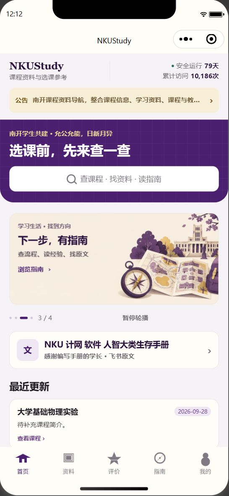
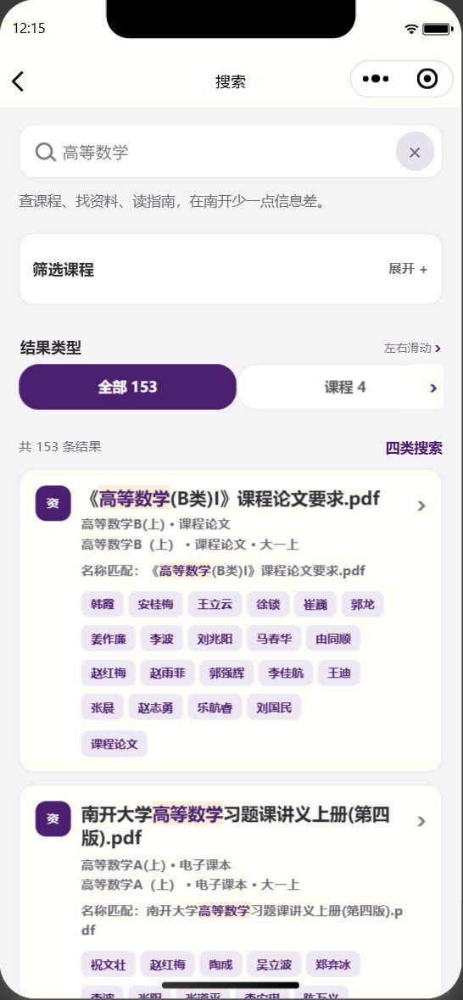
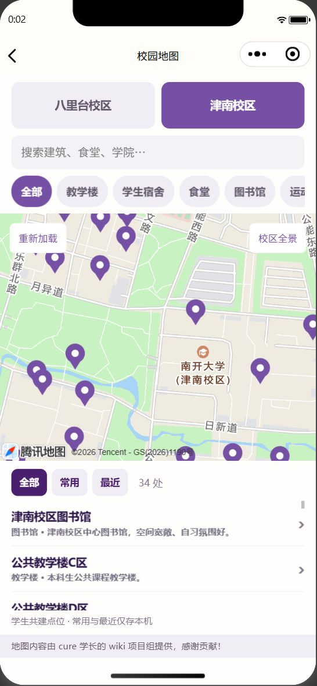

# 💜 NKUStudy · 校园体验更新

**允公允能，日新月异**

南开紫 × 暖白 · 同学共建 · 原生微信小程序

`2026.10.02`　`候选开发版 2.1.0`　`本地检查 292 / 292`

> 本轮围绕「更好找、更好用、写到一半不怕丢」更新。保留南开校园气质与现有内容来源，不引入第二套后端，不恢复 AI 或支付功能。

## ✨ 一眼看懂这次更新

| 页面 | 这次有什么变化 | 带来的体验 |
|---|---|---|
| 🏠 首页 | 校训元素、更清楚且更易点击的原生搜索入口、小字层级与安全区优化 | 南开特色保留，入口更醒目 |
| 🔎 搜索 | 可收起的课程筛选、最近搜索、清空确认、骨架加载、空结果出口 | 少填一次关键词，少一些界面拥挤 |
| 🗺️ 校园地图 | 常用地点、最近访问、可展开介绍、空列表恢复入口 | 常去的图书馆、教学楼更容易再次找到 |
| ⭐ 我的收藏 | 加载 / 失败 / 重试 / 未登录 / 空收藏状态补齐 | 不再把网络失败误看成没有收藏 |
| 💬 写评价 | 自动保存、按课程恢复、字数提示、清除确认、提交期间锁定 | 更换课程不串草稿，失败时保留内容 |
| 📝 意见反馈 | 自动保存与恢复、纠错预填独立草稿、更好点击的类型按钮 | 反馈与联系方式不混入其他账号或表单 |

## 🎓 南开的特色，继续留下来

- 保留 **NKUStudy、南开紫、暖白、校训与同学共建定位**。
- 保留四张首页轮播、平台公告、飞书入口、完整协作者名单与非官方声明。
- 保留八里台、津南 **全部 76 个地点**，不擅自改动坐标、介绍和原图。
- 保留地图常驻鸣谢：**地图内容由 cure 学长的 wiki 项目组提供，感谢贡献！**
- 地图点位仍为学生共建参考，请以现场标识为准；重要制度仍以最新官方文件为准。

## 🔐 本机记录的边界

| 记录 | 数量与保存规则 | 是否云端同步 |
|---|---|---|
| 搜索历史 | 最多 10 条，每条最多 80 字；仅明确搜索/打开结果时记录，可确认清空 | 否 |
| 地图常用 | 只接受现有点位的稳定标记 ID | 否 |
| 最近地点 | 去重、最新优先，最多 12 处，按当前校区与筛选显示 | 否 |
| 评价与反馈草稿 | 每个账号合计最多 20 份；超过 7 天不再恢复，后续保存时清理 | 否 |
| 课程收藏 | 继续使用现有账号与服务器接口 | 是 |

草稿以 350ms 合并保存，页面隐藏/退出时补存。不同账号、不同课程、普通反馈与纠错预填互相隔离；未登录反馈单独保存。只保存表单必要字段，不额外复制 Token、头像或昵称。

**自动保存 ≠ 自动提交。** 仍需手动点击提交；提交失败保留内容，明确成功后才清除。若存储/清除失败，页面会说明，先核对“我的评价/我的反馈”，不要盲目重复提交。更换手机、清除微信缓存或卸载小程序，可能丢失这些本机记录。

## 🧪 验证成绩单

| 检查 | 结果 | 能证明什么 |
|---|---|---|
| 完整发布检查 | ✅ 292 / 292 | 契约 36、页面 106、搜索/指南 75、内容 25、学习指南针历史回归 50 |
| 新增体验专项 | ✅ 16 / 16（计入上述总数） | 上限、去重、损坏存储、7 天过期、账号/课程隔离、迟到请求、提交成败 |
| 小程序静态门禁 | ✅ 25 页面 / 5 Tab | 配置、文件、组件引用、JS 语法与安全模式 |
| WXML 结构检查 | ✅ 34 文件 / 0 错误 | 模板标签与结构 |
| 生产 `/api/v1/home` | ✅ 只读检查 | 响应符合现有公开契约；不代表真实投稿验收 |
| 差异空白检查 | ✅ 通过 | 没有新增空白错误 |
| GitHub CI | ✅ [已通过](https://github.com/mzk-C4/NKU-study-wxapp/actions/runs/36954027383) | main 代码提交 d3427d9 的 test job 执行 npm test 成功 |
| 本轮模拟器界面与交互 | ✅ 首页 / 搜索 / 两校区地图冒烟验证 | 原页面实际显示、搜索与筛选、地图底图及重载；不代表全部表单或真机验收 |
| 真机 / 小屏 / 大字体 | ⬜ 未执行 | 自动化不能代替手机端体验 |

本轮测试没有向生产提交评价、反馈或头像，没有读取上传私钥，没有关闭微信合法域名校验。

## 📱 原页面实测 · 10 月 2 日至 5 日补充

**按用户最新要求，继续使用原小程序页面，不落地新的 `nku study` HTML 设计稿。** 本聊天没有改动原生页面、路由或业务接口，也没有把新照片加入小程序打包。

<table>
  <tr>
    <td align="center"><strong>🏠 原首页</strong> 校训、搜索、原轮播与飞书手册</td>
    <td align="center"><strong>🔎 真实搜索</strong> 高等数学 · 当次返回 153 条结果</td>
    <td align="center"><strong>🗺️ 津南地图</strong> 34 个地点 · 底图与鸣谢保留</td>
  </tr>
  <tr>
    <td align="center"></td>
    <td align="center"></td>
    <td align="center"></td>
  </tr>
</table>

- 微信工具授权已返回成功；版本关系一致、登录未过期，当前不要求 CLI 访问令牌。10 月 4 日项目窗口没有活动运行实例，重新打开现有项目窗口后恢复，未修改项目配置。
- 首页重新编译后能实际显示，点击搜索进入搜索页；课程筛选展开 / 收起分别读取到 `true / false`。输入并确认“高等数学”后，当次显示 153 条真实索引结果；数量只代表该次检索，不是固定线上统计。
- 八里台底图与 42 个地点可见。使用按钮的明确标识切换到津南后，实际读取校区为津南，列表为 34 处；点击“重新加载”后底图、津南选择和 34 处列表仍显示。
- 地点详情可见介绍、导航按钮和常驻鸣谢；发现原有常用状态时保持原样，没有为了测试取消用户常用。未清空本机搜索历史、草稿、常用或最近记录。
- 自动化的 `nth-child` 选择器曾命中第一个校区按钮，不能据返回成功声称津南切换通过；改用已核对的 `data-id` 后才确认切换。一次地点等待超时也没有被记作成功，不据工具输入现象改写页面。
- 所读取的控制台 `error` 关键词日志无匹配；不是对所有日志或全部功能的零错误声明。草稿、收藏的全部登录 / 失败状态、真机、小屏和大字体验尚未完成本轮实际验收，仍需按下方清单检查。
- 整理日志时工作区出现了并行的地图数据、脚本、标记资源与本机偏好修改。这些不是本聊天的改动，原样保留、不纳入本次日志提交；以上实测不代表这些后续修改已验收或可上传。

## 🚀 交付进度

- ✅ 功能、样式、回归测试与文档已在本地完成。
- ✅ 已核对 GitHub main，无未同步的远端新增提交。
- ✅ 代码与本日志已推送 [GitHub main](https://github.com/mzk-C4/NKU-study-wxapp/tree/main)，功能提交 [d3427d9](https://github.com/mzk-C4/NKU-study-wxapp/commit/d3427d9e2f8d749ab32f92b307e28b3476406cbd)，远端提交已独立核对，CI 通过。
- ✅ 微信连接与授权已恢复，完成上节所列原页面模拟器冒烟验证；不再把此前连接故障当作当前阻塞。
- ⏳ 开发版候选 **2.1.0**，上传目标待用户确认，尚未上传。
- 🚧 开发版成功回执仍缺：上传前需确认现有 AppID 与候选版本。最新要求是保留原页面，新视觉稿留在本地，不随本次验收日志上传。版本确认后再执行发布检查和上传；已有功能、自动化与 Git 交付保留。
- ⬜ 不包含微信审核、正式发布或生产后端部署。

上传和模拟器验证完成后，本节按真实结果补充，不把“发起上传”写成“上传成功”。实时交接以 [协作计划](./COLLABORATION_PLAN.md) 为准。

## 👣 五分钟人工验收

1. 首页点搜索，搜一门课程；返回清空输入，点最近搜索再次查看；展开与收起课程筛选。
2. 指南 → 校园地图，八里台/津南分别点一个地点，设为常用，切换“常用/最近”；展开介绍、重新加载地图，确认导航按钮和鸣谢仍可见。
3. 我的 → 收藏，检查未登录提示；登录后确认加载、空状态和已有收藏。
4. 写评价填写几句后退出，再进同一课程检查恢复；切换课程与账号，确认没有串内容。
5. 意见反馈写标题和正文后退出，再进入检查恢复；从课程缺失入口进入，确认没有覆盖普通反馈草稿。无需为了验收向生产发送测试内容。

**把信息留给同学，把细节留在每一次使用里。🌱**

[📖 README](../README.md) · [🤝 当前交接](./COLLABORATION_PLAN.md) · [🧩 API 契约](./API.md)

