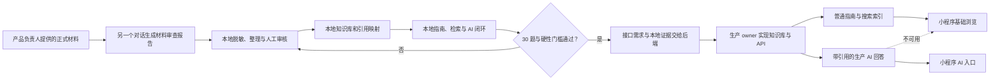

# NKUStudy“学习指南针”内容盘点、接口设计与实施计划

> 日期：2026-08-22
>
> 状态：指南首页UI与四张画面提示词已齐；SOURCE_MANIFEST第一版已建立，除独立进行的SRC-005外其余核心源材料已就绪
>
> 产品方向依据：[`LEARNING_COMPASS_KNOWLEDGE_BASE_HANDOFF.md`](./LEARNING_COMPASS_KNOWLEDGE_BASE_HANDOFF.md)
>
> 当前任务状态 owner：[`COLLABORATION_PLAN.md`](./COLLABORATION_PLAN.md)
>
> 重要边界：本文提出的是待评审接口，不是当前生产契约；生产事实仍以根目录 `API.md`、生产实现和生产 owner 为准。

## 一、第一轮内容文件盘点

### 1.1 当前结论

工作区已经加入 `Documents/` 材料，但目前没有任何内容可以直接进入正式知识库。学生手册分类审查以及与 2026—2027 第一学期选课通知的冲突审查均已完成。对照结果未发现可直接裁定的直接冲突，足以形成限定本学期的日期、入口和操作 `draft`；但自修 GPA 门槛（3.7 与 3.0）和每学期门数（一般 1 门与 2 门）构成潜在冲突。通知引用南发字〔2026〕82号，手册收录南发字〔2024〕62号；缺少 2026 版办法全文前，相关长期规则必须保持 `blocked-by-2026-rule`。

截至本次盘点：

- 已盘点物理文件：**490 个**；去重后 **244 份内容材料**，另有 4 个辅助 JSON；
- 第一阶段核心本地 draft 候选已包含学生手册、当前选课通知和已核验的考试成绩、AI规范、学籍学位及学术诚信正式材料；48份“通过”培养方案只内部保留，不进入指南 draft 或AI来源；
- 生产指南：根据 2026-08-18 已记录的公开快照，**0 条**；
- 学生手册：**1 份、142 页图片型 PDF + 已确认等价的完整 Markdown**，分类审查已完成；覆盖 22 个直接相关顶层内容单元，但仍需补齐 P0 材料，不直接作为已发布制度依据；
- 生产课程资料索引：同一快照中有 **840 条资料摘要**，但原始文件和审核状态不在本仓库，需由生产 owner 另行盘点；
- 课程知识和经验材料：当前审查结果为 **0 份**；
- 本地参考指南：`server/data/seed.json` 和 `server/data/runtime.json` 各含 5 条相同 fixture，其中只有 4 条能映射到当前四个指南分类；这些内容没有正式来源，不能发布为生产知识。

### 1.2 已发现材料的判定

| 材料 | 当前用途 | 能否作为正式知识源 | 判定 |
|---|---|---|---|
| 根目录 `API.md`、`docs/API.md` | 当前接口事实与客户端契约 | 否 | 技术契约，不是学生学习规则 |
| `docs/LEARNING_COMPASS_KNOWLEDGE_BASE_HANDOFF.md` | 产品方向与已确认规则 | 否 | 方案依据，不是校方原文 |
| `server/data/seed.json`、`runtime.json` | 本地参考 API 与页面联调 | 否 | fixture 无正式来源；“资料分享”还超出当前四分类 |
| `图片和附件/` | Bug 标注、页面截图和课程页面截图 | 否 | 主要用于 Bug 说明；课程描述截图也不是可核验的正式原文 |
| `NKU腾讯核心技术组 bug修复.md` | Bug 分工与验收背景 | 否 | 开发记录，不是知识内容 |
| `Documents/材料审查报告.md` | 材料盘点与风险结论 | 否 | 审查报告，不是制度原文 |
| [`2025级本科学生手册Markdown分类审查报告.md`](./2025级本科学生手册Markdown分类审查报告.md) | 学生手册分类、覆盖与缺口证据 | 否 | 审查报告，不是制度原文；结论为“需要补充材料后再处理” |
| [`2026-2027第一学期选课通知与学生手册冲突审查报告.md`](./2026-2027第一学期选课通知与学生手册冲突审查报告.md) | 两份正式材料候选的关系与冲突证据 | 否 | 未发现直接冲突；报告当时建议等待82号，后续产品决定改为局部冻结且不再追索 |
| [`学习指南针缺失材料联网检索报告.md`](./学习指南针缺失材料联网检索报告.md) | 官方来源发现与缺口证据 | 否 | P0部分补齐；报告中的关键链接已做公开只读核验，82号全文仍未找到 |
| `Documents/学生手册/南开大学2025本科学生手册_上册_七批合并完整电子化版.md` | 2025 级本科生手册正文 | 本地 draft 候选 | 用户已确认与 PDF 内容一致；分类审查完成，仍需适用范围、时效和条款人工复核 |
| `Documents/南开大学2026-2027学年第一学期本科生选课通知.pdf`、同名 `.md` | 2026-2027 学年选课通知的原件与电子化文本 | 本地 draft 候选 | Markdown 已包含系统入口、时间表和操作要求；通知引用南发字〔2026〕82号，学生手册只收录南发字〔2024〕62号，需新版办法裁定长期规则差异 |
| `Documents/培养方案/` 及 `_html/` | 专业/项目培养方案 | 仅内部保留 | 不作为一级分类、指南正文或第一阶段AI来源，不再列为当前整理任务 |
| 生产课程资料索引 | 未来候选池 | 第一阶段不可用 | 课程资料、评价和同学经验不进入第一阶段指南知识库或AI来源 |

### 1.3 首批必须收集的真实来源

首批只收集与第一阶段五个指南分类直接相关的文件或公开页面：

| 优先级 | 来源方向 | 归入分类 | 最低要求 |
|---|---|---|---|
| 已具备 | 2025 级本科生学生手册 Markdown | 五类指南的制度基础 | 已完成分类审查；只作为制度框架候选，不替代当前通知或个人培养方案 |
| 内部保留、不进入首期知识库 | 2025培养方案材料集 | 不映射为指南分类 | 现有材料不继续作为指南内容任务，不进入第一阶段AI来源 |
| 不再追索 | 《南开大学本科生选课管理办法》（南发字〔2026〕82号）全文 | 选课与修读 | 用户确认该内部依据不公开且无需继续寻找；对应自修差异局部冻结，不阻塞其他内容 |
| 已具备 | 当前学期选课材料包 | 选课与修读 | 教务部官方发布页、150页官方选课手册和联系电话附件均已核验；长期自修规则仍由82号阻塞 |
| P1 | 后续单独发布的补退选、补登或期中退课通知（如存在） | 选课与修读 | 当前通知已给基础安排；后续只核验课程/学院例外、表单或临时变更，不再视为首轮硬阻塞 |
| 已具备 | 《南开大学本科课程考试与成绩管理规定》（教字〔2024〕2号） | 考试成绩 | 官方完整PDF已核验，可覆盖成绩录入、异议复议和成绩更改等长期规则 |
| 不纳入当前必备 | 当前学期期末考试安排、当前补考/缓考专项通知 | 考试成绩 | 用户确认期末考试安排没有必要；学生手册和教字〔2024〕2号已覆盖首期所需长期框架，专项通知按未来真实需求再补 |
| 已具备 | 2026转专业、辅修和微专业官方入口 | 学业拓展、学籍 | 教务部官方汇总/通知页已核验；具体学院内容仍保持学院边界 |
| 已具备 | 教字〔2025〕5号本科教学人工智能工具使用规范 | 学术诚信 | 官方完整PDF已核验；学院/课程仍可制定更严格要求 |
| 已具备 | 南发字〔2025〕27/28号学术不端及考试违纪办法 | 学术诚信 | 官方完整PDF已核验，学生手册原文获得稳定来源链 |
| 已具备 | 南发字〔2018〕29号学生申诉管理规定 | 学生权利与支持 | 信息公开网目录及完整PDF已核验；公开电子提交入口仍未找到 |
| P2 | 当前课表节次、教室管理、学生证补办、奖助和支持服务 | 后续增强 | 时效核验后再决定是否纳入，不阻塞首期五类指南 |

首期材料范围已经具备：全校学生手册、当前学期选课通知、考试成绩长期规定、学籍学位与学术规范材料。培养方案不进入首期指南或AI来源。当前重点从“继续找文件”切换为来源核验、五分类知识条目设计和UI内容合同落实。

### 1.4 内容负责人需要提供的最小信息

不要求人工维护复杂元数据。每份来源只需先提供：

1. 原始文件或公开链接；
2. 用户看到的来源名称；
3. 它属于正式文件、课程知识还是同学经验；
4. 已知的适用专业、入学年份或学期；
5. 是否确认允许公开。

文档 ID、片段 ID、页码映射、文本提取、关键词和索引字段由导入流程自动生成，再由人工核对关键范围和时效。

### 1.5 内容盘点工作表

后续收到真实文件时，在本表追加记录。没有拿到原文时不得把“知道有这份文件”写成已完成。

| 来源名称 | 文件/链接 | 层级 | 适用范围 | 时间 | 公开确认 | 当前状态 | 阻塞 |
|---|---|---|---|---|---|---|---|
| 2025 级本科生学生手册 | `Documents/学生手册/南开大学2025本科学生手册_上册_七批合并完整电子化版.md` | 正式文件候选 | 暂按 2025 级本科生；具体条款依原文对象 | 2025 上册；含不同年份制度 | 用户确认 Markdown 与 PDF 一致 | 分类审查完成；本地 draft 候选 | 缺当前通知、专业方案和部分现行性核验 |
| 2025培养方案材料集 | `Documents/培养方案/`、`Documents/培养方案/_html/` | 内部材料 | 242份专业/项目材料 | 2025版本；日期各异 | 文件已齐 | 不进入首期知识库 | 不作为一级分类、指南正文或AI来源；不再列为当前整理任务 |
| 当前选课文件 | `Documents/南开大学2026-2027学年第一学期本科生选课通知.pdf`、同名 `.md`；[教务部官方页](https://jwc.nankai.edu.cn/2026/0817/c35933a601256/page.htm) | 正式文件候选 | 2026-2027 第一学期；时间表分别覆盖 2022—2026 级及全校 | 教通字〔2026〕58号；2026-08-17 | 官方页及附件已核验 | 冲突审查完成；本学期 draft 候选 | 自修GPA、门数和日期保留来源差异，不再追索82号或强行合并 |
| 当前退补选文件 | 已包含于当前选课通知 | 正式文件候选 | 2026-2027 第一学期本科生 | 通知内明确 | 已完成对照 | 基础安排可作本学期 draft | 后续专项通知、表单或课程例外如存在则继续补充 |
| 考试与成绩长期规定 | [教字〔2024〕2号官方PDF](https://mse.nankai.edu.cn/_upload/article/files/2e/eb/4d4534704d8dbe4477debe17727e/591b1f7a-98ca-494b-8918-fdeae04e6b3b.pdf) | 正式文件候选 | 南开本科课程 | 2024-05-13 | 官方PDF已核验 | 本地 draft 候选 | 不包含2026-2027第一学期具体考试安排 |
| 当前学期考试/补考专项材料 | 当前不收集 | 后置材料 | 2026-2027第一学期本科生 | 未来按需 | 用户确认非当前必要 | 不列缺口 | 不用往年通知替代；未来有明确功能需求再收集 |
| 课程资料候选池 | 生产侧盘点 | 课程知识/经验 | 具体课程 | 多学期 | 部分未知 | 未开始审核 | 原文件不在本仓库 |

### 1.6 学生手册文本来源与分类审查方案（已更新）

> 2026-08-22 更新：内容负责人已提供 `Documents/学生手册/南开大学2025本科学生手册_上册_七批合并完整电子化版.md`，并确认其内容与原始 PDF 一致。此前“必须先做 OCR 才能分类”的假设已被纠正，不再构成阻塞；原始 PDF继续留档，必要时只做局部抽查。

分类审查已依据 [`LEARNING_COMPASS_STUDENT_HANDBOOK_CLASSIFICATION_PROMPT.md`](./LEARNING_COMPASS_STUDENT_HANDBOOK_CLASSIFICATION_PROMPT.md) 完成，正式报告见 [`2025级本科学生手册Markdown分类审查报告.md`](./2025级本科学生手册Markdown分类审查报告.md)。同文件夹七份 DOCX 不纳入本轮依据。

#### 审查结论

- 总结论：**需要补充材料后再处理**；当前只可作为需要人工核验的本地 `draft` 候选；
- 已覆盖：全校制度层面的选课流程、退补选、考试成绩、学分认定、学籍异动、学位条件、考试纪律、学术不端和申诉；
- 部分覆盖：培养方案，只覆盖全校框架、专业设置目录和辅修/微专业等总则，不能替代 2025 级具体专业培养方案；
- 不可直接回答：当前学期日期和系统入口、具体专业毕业审核、考试/补考安排、成绩复核入口和个案审批结果；
- 引用优先使用文件标题、文号、章节和条款编号；没有正文页码时不得编造页码；
- 涉及联系方式、表单个人信息字段和高时效内容的片段，进入知识库前必须人工复核和脱敏。

#### 当前处理边界

- 可以先整理制度框架类知识条目草稿，但不得进入 `review` 或 `published`；
- P0 材料未补齐前，不发布当前学期操作指南、专业培养方案指南或成绩复核指南；
- 任何“最新、当前、本学期”的回答都必须绑定后续正式通知；
- 如与后续学校、学院正式文件冲突，以最新且适用范围更精确的官方文件为准。

### 1.7 培养方案的当前处理边界（已确认）

- “培养方案”不作为一级分类；
- 第一阶段不复制、发布或维护具体培养方案内容；
- 现有PDF、HTML和状态材料只内部保留，不作为第一阶段指南正文或AI来源；
- 不再把整理242份培养方案或优先处理48份“通过”候选列为当前指南任务；
- 涉及具体课程、学分和毕业要求时，引导用户查看本人教学管理信息系统中的当前培养方案；
- 未来如果重新讨论培养方案能力，必须重新核验时效、数据来源和维护责任，不能自动恢复旧计划。

### 1.8 选课通知与学生手册冲突审查结果

完整报告见 [`2026-2027第一学期选课通知与学生手册冲突审查报告.md`](./2026-2027第一学期选课通知与学生手册冲突审查报告.md)。

- **直接冲突：** 未发现可直接裁定的直接冲突；
- **潜在冲突 1：** 手册南发字〔2024〕62号规定自修 GPA 为 3.7（含）以上，通知教通字〔2026〕58号写为 3.0（含）以上；
- **潜在冲突 2：** 手册规定每学期自修一般不超过 1 门，通知写为一般不超过 2 门；
- **当前处理：** 自修GPA、门数和日期标记为局部来源差异；不再追索82号，也不提供强行合并后的稳定结论；
- **可先整理：** 五阶段、32 学分上限、跨选基本原则等双来源一致内容可作为 `stable-candidate`；2025级时间表、系统入口、每日 13 点放课、W 记载、课程例外和本学期操作可作为 `semester-specific`；
- **旧结论修正：** 当前学期基本时间表、系统网址、主要菜单和退补选/补登/期中退课安排已经由通知补齐，不再列为缺失；
- **发布边界：** 当前所有内容仍只到本地 `draft`，不得进入 `published`。

### 1.9 缺失材料联网检索安排

联网检索提示词见 [`LEARNING_COMPASS_MISSING_MATERIALS_WEB_SEARCH_PROMPT.md`](./LEARNING_COMPASS_MISSING_MATERIALS_WEB_SEARCH_PROMPT.md)。检索由用户在能够调用 Chrome 或其他联网工具的新聊天框执行，本仓库当前不直接访问或写入外部系统。

- 第一轮只查南发字〔2026〕82号全文，以及教通字〔2026〕58号的官方发布入口和附件；
- 第二轮查明确目标专业的2025级培养方案发布证据，以及考试、缓考、补考、成绩发布和复核材料；
- 第三轮再查选课系统手册、专项通知、转专业/辅修/微专业、生成式 AI 规范和其他 P1/P2；
- 搜索结果必须来自可打开并核验的南开官方页面或文件；第三方转载、搜索摘要和 AI 摘要不能作为正式证据；
- 未找到时保留 `not-found` 或 `login-blocked`，不得猜测正文。

### 1.10 联网检索回交结果与官方核验

> 本节记录外部报告回交后的初步判断；考试范围、培养方案完整性和自修日期来源关系已经由后续1.11纠正。

完整回交报告见 [`学习指南针缺失材料联网检索报告.md`](./学习指南针缺失材料联网检索报告.md)。报告作为外部检索证据保存；以下事实另经公开官方页面或PDF只读核验：

- [教务部选课通知页](https://jwc.nankai.edu.cn/2026/0817/c35933a601256/page.htm)确实发布于2026-08-17，并挂载150页选课手册和1页教学办公室联系电话附件；
- 150页官方选课手册明确引用南发字〔2026〕82号，但公开检索仍未获得82号全文；
- [教字〔2024〕2号](https://mse.nankai.edu.cn/_upload/article/files/2e/eb/4d4534704d8dbe4477debe17727e/591b1f7a-98ca-494b-8918-fdeae04e6b3b.pdf)官方PDF可核验成绩录入、成绩异议/复议和成绩更改长期规则；
- [教字〔2025〕5号](https://jwc.nankai.edu.cn/_upload/article/files/cd/0c/80bffe1b40908e13d32ee2da55c8/bb8bcf0c-649d-45f6-8834-63996489be53.pdf)官方PDF可补齐本科教学AI工具使用规则；
- 2026转专业、辅修和微专业的教务部官方入口已核验；考试违纪、学生学术不端和学生申诉的官方完整文件来源也已核验；
- 截至2026-08-23的公开官方检索中，当前学期期末考试安排、当前全校统一补考材料仍未找到；这只表示本次未发现，不证明文件不存在或以后不会发布。

#### 选课官方原件内部年份风险

官方150页选课手册的主体时间表和落款均为2026年，但官网当前附件的“自修申请时间”写为“2025年9月7日”。进一步视觉核验发现，本地8页PDF第6物理页写的是“2026年9月7日”，本地Markdown与本地PDF一致；两份PDF哈希和大小均不同。因此当前不是“Markdown静默改错”，而是本地8页通知PDF与官网150页选课手册存在来源版本差异。

- 本地8页PDF：323141字节，SHA-256 `F3AB7E8FF7C5296F86D1544186BBFABB3D4D1FC9B186BA1AAE7DDC036FEB8B03`；
- 官网150页PDF：2476783字节，SHA-256 `18EBEBBA019A785411345AA1DC33EFFF8F19A1E0CB1BA0A71DD7A867888A3EB6`；
- 本地Markdown继续标记为“与本地8页PDF一致”，不再声称与官网150页版本逐字一致；
- 在内容负责人核验两份原件并决定采用哪一版本前，自修申请年份保持 `source-variant-unresolved`，不进入自动回答。

### 1.11 2026-08-23 用户范围纠正与PDF视觉核验

- 当前学期期末考试安排不属于学习指南针首期必备材料，从缺失清单移除；补考/缓考专项通知也不再作为当前硬阻塞；
- 培养方案文件已经齐备，但用户后续明确决定其不进入一级分类、指南正文或第一阶段AI来源；不再安排整理现有242份材料作为指南任务；
- 用户确认南发字〔2026〕82号无法取得且无需继续寻找；自修差异只冻结对应字段，不再构成整体材料阻塞；
- 选课系统完整操作手册和后续专项通知属于可选增强材料，不阻塞当前方案推进；
- 自修申请年份需要用户直接核验本地8页PDF第6物理页与官网150页PDF第4物理页后再决定。

### 1.12 五分类内容覆盖审计

完整审计见 [`LEARNING_COMPASS_FIVE_CATEGORY_CONTENT_AUDIT.md`](./LEARNING_COMPASS_FIVE_CATEGORY_CONTENT_AUDIT.md)。以正式UI合同的五分类为准，当前结论是五类均有足够正式材料，后续主线从“补文件”切换为“整理指南内容”。

- 选课与修读：整体材料足够，自修GPA、门数和日期局部冻结；
- 考试与成绩：学生手册、教字〔2024〕2号和W记录覆盖合同主题；
- 学籍与毕业：学生学则、学位细则和延期/提前毕业细则覆盖合同主题；
- 学业拓展：转专业、辅修、微专业、学分认定、校际交流、国际小学期和实习均有来源；
- 规范与权益：AI规范、学术不端、考试违纪、申诉和学生权利均有来源；
- 培养方案和当前学期期末考试安排均不属于当前内容缺口。

### 1.13 源材料统一准备阶段

完整清单见 [`LEARNING_COMPASS_SOURCE_MATERIAL_PREPARATION_CHECKLIST.md`](./LEARNING_COMPASS_SOURCE_MATERIAL_PREPARATION_CHECKLIST.md)。本阶段先不拆知识条目、不写指南，只整理原始文件、Markdown和最小来源清单。

- 已完成：SRC-001、SRC-002、SRC-003、SRC-004；
- 核心完成、附件后置：SRC-006辅修通知、SRC-007微专业通知；
- 独立进行、不阻塞其他内容：SRC-005转专业父来源与学院个性化子来源；当前28份学院DOC/DOCX候选已到位，环境学院已补齐，信息与传播学院已按官网2026名称修正，当前仅缺金融学院PDF并待统一Markdown；
- `Documents/SOURCE_MANIFEST.md`第一版已建立，SRC-005以`in-progress`父来源登记，后续逐学院追加；
- 学生手册已完整收录的学则、学位、学分认定、考试违纪、学术不端和申诉等制度不重复转换全文，只登记独立官方链接；
- 培养方案、课程资料、期末考试安排和82号文件不进入本阶段材料包；
- 所有材料先完成忠实电子化和来源关联，之后再统一映射到五分类。

## 二、职责与数据流

### 2.1 Owner 边界

| 层级 | Owner | 主要职责 |
|---|---|---|
| 原始文件与内容判断 | 邵游堃及内容协作者 | 收集来源、确认适用范围、校对整理结果、准备验证问题 |
| 本地知识库与 AI 原型 | 邵游堃及本地实现协作者 | 本地导入、审核状态、检索、引用、问答 mock/provider 和验证报告 |
| 生产数据、导入、审核、检索和 AI | 沈弋皓及 `NKUStudy.top` 生产 owner | 保存来源、解析/脱敏、审核状态、发布索引、模型密钥、限流和日志 |
| 小程序指南与 AI 交互 | 邵游堃 | 指南浏览、引用打开、AI 问答状态、错误与降级入口 |
| “我的”个人上下文 | 丁宇鑫 | 入学年份和专业的本机设置、编辑和清除 |
| 契约评审、集成与发布 | 马兆坤、沈弋皓 | 冻结接口、联调、回归、体验版和发布证据 |

本地原型可以复用本仓库的参考 `server/`、本地文件和 mock/provider，但必须保持可替换、不可部署，并明确标注为本地验证。最终生产 API、数据和 AI 服务仍只能由 `NKUStudy.top` 生产 owner 承载。

### 2.2 数据流



### 2.3 发布状态

只采用三个面向内容维护者的状态：

- `draft`：已导入或正在整理，不能被用户或 AI 检索；
- `review`：等待人工确认，不能被用户或 AI 检索；
- `published`：通过审核，可以进入普通指南、公开搜索和 AI 索引。

撤回、版权投诉或发现错误时，内容先退出 `published`，立即停止新的公开展示和 AI 检索；具体记录仍由生产 owner 保留用于审计和修订。

### 2.4 本地知识库必须包含的内容

本地原型先固定内容结构，不先固定向量模型、数据库或页面样式：

1. **来源清单**：原始文件/链接、用户可见名称、正式/课程/经验层级、适用范围和时间；
2. **审查报告**：文件真实性、完整性、冲突、隐私、版权和缺失材料；
3. **规范化正文**：从 PDF、Word 或网页提取的可检索文本，以及页码/章节位置；
4. **知识条目**：按选课与修读、考试与成绩、学籍与毕业、学业拓展、规范与权益整理的事实和步骤；
5. **引用映射**：每条知识回到对应原文、页码/章节和公开入口；
6. **指南样例**：面向普通浏览的标题、摘要、章节、适用范围、时间和来源；
7. **问答样例**：问题、预期结论、必须引用的来源、允许的拒答和冲突处理；
8. **验证记录**：30 题结果、错误案例、缺失知识和下一轮补充材料。

技术 ID、切片、关键词和索引字段由本地工具自动生成。人工主要负责确认来源、范围、时效、脱敏结果和最终内容。

原始材料如果含个人信息、版权限制或非公开内容，默认放在不提交 Git 的本地私有目录；只有经过明确授权的脱敏副本、审查报告或结构化样例才能考虑进入仓库。

## 三、接口设计草案

### 3.0 本地先行原则

- 阶段 1～3 先在本地完成：材料审查结果、本地知识库、检索、引用映射和 AI 问答闭环都可以使用本地文件、本地参考服务或本地 provider adapter 验证。
- 本地原型必须尽量复用未来生产接口的请求/响应结构，但本地地址、fixture 和 mock 不能写入生产配置，也不能被称为生产数据。
- 后端新增接口、生产知识存储和模型部署暂不开始；本地闭环通过后，再把独立的 [`LEARNING_COMPASS_API_REQUIREMENTS.md`](./LEARNING_COMPASS_API_REQUIREMENTS.md) 交给后端负责人实施。
- 页面视觉和页面最终布局暂不锁定；当前只冻结数据结构、状态、错误、引用和降级规则，等英文设计文档到位后再生成 GPT image 2 提示词和页面方案。

### 3.1 现有接口保持可用

第一阶段继续复用：

- `GET /api/v1/guides`
- `GET /api/v1/guides/{guideId}`
- `GET /api/v1/search-index`

AI 不可用时，这三个读取入口仍应独立工作。当前生产指南为 0，因此首要后端任务不是先接模型，而是先让至少一批真实、已审核指南进入现有读取接口。

### 3.2 现有指南详情的最小扩展

当前详情只有 `steps` 和单一 `source_title/source_url`，不能完整表达多章节、多来源引用。建议生产 owner 在兼容旧字段的前提下增加：

```json
{
  "sections": [
    {
      "id": "stable-section-id",
      "title": "章节标题",
      "body": "正文",
      "citation_ids": ["source-1"]
    }
  ],
  "sources": [
    {
      "id": "source-1",
      "title": "来源名称",
      "url": "https://公开原文地址",
      "location_label": "第 12 页 / 第三章"
    }
  ]
}
```

兼容规则：

- 旧 `steps` 暂时保留，流程型指南仍可使用；
- 旧 `source_title/source_url` 暂时保留，客户端过渡期可继续展示单一来源；
- 新客户端优先使用 `sections/sources`；
- 只有公开、安全的 HTTPS URL 可以进入公共响应；内部路径、对象存储密钥和审核字段不得返回。

此扩展在生产 owner 正式确认和实现前，不写入 `docs/API.md`，也不由小程序提前调用。

### 3.3 AI 问答最小公开接口

生产后端未来新增一个无状态接口；本地阶段先实现同形状的本地 mock 或 provider adapter：

`POST /api/v1/guide-assistant/answers`

第一阶段会话保存在小程序本机 30 天。客户端每次只发送当前问题、最多 9 轮历史上下文，以及用户主动设置的入学年份和专业；服务端不必先建设账号会话系统。

请求示例：

```json
{
  "question": "我是 2025 级某专业学生，退补选时需要注意什么？",
  "history": [
    { "role": "user", "content": "上一轮问题" },
    { "role": "assistant", "content": "上一轮回答" }
  ],
  "profile": {
    "admission_year": 2025,
    "major": "用户主动填写的专业"
  }
}
```

成功响应示例：

```json
{
  "code": 0,
  "data": {
    "answer": "直接回答用户问题。",
    "applicable_scope": "2025 级某专业；以当前收录文件为依据",
    "freshness_notice": "如与后续通知冲突，以最新官方文件为准。",
    "citations": [
      {
        "id": "source-1",
        "marker": "来源 1",
        "title": "来源名称",
        "url": "https://公开原文地址",
        "location_label": "第 12 页 / 退补选章节",
        "excerpt": "与回答直接相关的原文片段"
      }
    ]
  }
}
```

服务端必须执行：

- 单次 `question` 最多 1000 字；
- `history` 最多包含 9 轮已完成问答；客户端第 10 轮完成后提示新开会话；
- 只检索 `published` 内容；
- 重新检索当前问题，不把历史 assistant 文本当成事实来源；
- 有事实性回答时必须返回至少一个有效引用；无依据时明确拒答；
- 模型密钥、内部提示词、片段内部 ID、私有路径和诊断信息不进入公共响应；
- 正式公开后默认每用户每日 20 次；有登录身份时按账号限流，无登录身份时使用服务端认可的匿名标识并叠加 IP 滥用控制；
- 单次请求最长等待 30 秒；超时或异常自动重试 1 次。

若重试后仍失败，返回稳定错误码：

- `503 AI_UNAVAILABLE`：模型或检索服务不可用；
- `429 RATE_LIMITED`：超过正式公开后的使用次数；
- `400 INVALID_AI_QUESTION`：问题、历史或个人上下文不符合限制。

小程序收到 `AI_UNAVAILABLE` 后展示“浏览知识库”和“去搜索”两个入口，不影响原有指南、课程、资料和搜索页面。

### 3.4 管理端最小接口

以下接口未来应在 `NKUStudy.top` 生产仓库中实现，并继续使用现有管理员 Cookie、服务端校验和私有日志；本地阶段只实现等价 fixture/脚本，不调用生产管理接口。本小程序仓库不实现这些生产管理接口：

| 方法与路径（建议） | 用途 |
|---|---|
| `POST /admin-api/knowledge-imports` | 上传文件或登记公开 URL，创建 `draft` |
| `GET /admin-api/knowledge-documents` | 查看草稿、待审核、已发布和已下架内容 |
| `GET /admin-api/knowledge-documents/{id}` | 查看解析文本、脱敏结果、范围、来源和引用定位 |
| `POST /admin-api/knowledge-documents/{id}` | 保存整理结果和最小元数据，使用 revision/CAS 防止覆盖 |
| `POST /admin-api/knowledge-documents/{id}/submit-review` | 从 `draft` 进入 `review` |
| `POST /admin-api/knowledge-documents/{id}/publish` | 审核通过并重建公开指南与 AI 索引 |
| `POST /admin-api/knowledge-documents/{id}/unpublish` | 撤回、纠错或投诉时退出公开与 AI 索引 |

解析、脱敏和模型处理是后台能力，不应让小程序直接上传文件给模型供应商。

## 四、小程序实现边界

### 4.1 页面和客户端状态

建议在现有指南模块内增加 AI 入口，不把 AI 设为新的 TabBar：

- 指南列表继续负责分类浏览和普通搜索入口；
- 指南详情支持章节、多个来源和“查看原文”；
- AI 问答使用独立页面，管理输入、最多 10 轮会话、引用卡片、30 天本机保存和降级状态；
- “我的”保存入学年份和专业，AI 页面读取后随请求发送；
- 全局搜索继续从 `/search-index` 搜索已发布指南，AI 不可用时不受影响。

### 4.1.1 正式 UI Content Contract

第一阶段页面内容合同见 [`LEARNING_COMPASS_UI_CONTENT_CONTRACT.md`](./LEARNING_COMPASS_UI_CONTENT_CONTRACT.md)。当前确认：

- 一级分类为五类，不再沿用旧四分类作为目标产品设计；
- 辅助标签、跨分类标签和二级标签延期，不建UI或字段；
- 培养方案和课程资料库不进入第一阶段指南/AI来源；
- 视觉面向第一阶段目标版本，覆盖指南首页、指南详情、AI正常回答和AI不可用四张独立画面；
- 当前只沉淀内容合同，尚未生成视觉提示词或修改页面代码。

来源打开按现有小程序能力分级处理：`resources.nkustudy.top` 等已配置域名的文件可下载后用 `wx.openDocument` 打开；已配置的站内来源可进入受控来源页；未配置的外部 HTTPS 页面不在客户端任意拼接 `web-view`，先提供复制链接作为降级。若首批正式文件要求直接打开外部页面，必须先由生产 owner 配置合法域名或提供受控公开镜像。

### 4.2 客户端分层

| 层级 | 建议职责 |
|---|---|
| 页面 | 参数、布局、输入控件、引用卡片、加载/失败/空态和跳转 |
| AI 会话 controller | 10 轮限制、本机 30 天保存、清除、新话题提示、并发保护 |
| `public-api` adapter | 构造问答请求、白名单映射回答和引用、稳定错误分类 |
| navigation/helper | 打开指南、课程、资料和安全公开来源 |
| 生产服务 | 检索、模型、引用、限流、超时、重试、审核状态和秘密 |

## 五、具体实施计划

### 阶段 0：材料审查与本地输入准备

负责人：邵游堃、内容协作者；另一个审查对话负责逐文件分析。

产出：使用材料审查提示词生成审查报告，并完成第 1.5 节盘点表。学生手册专项报告已完成，其他 P0 材料仍待提供和审查。

完成条件：

- 每份材料都有来源、层级、适用范围、时间和风险判定；
- 审查报告明确区分正式规则、课程知识、同学经验和未知内容；
- 报告不复述姓名、学号、联系方式等敏感信息；
- 缺失材料和需要补充的内容形成清单，不通过推测补齐；
- 学生手册已有完整 Markdown、分类报告、覆盖矩阵和 P0/P1/P2 缺口清单；
- 报告结论和引用定位经过内容负责人抽样复核后，才进入本地知识条目整理。

### 阶段 1：本地知识库与导入审核试验

负责人：邵游堃（内容核对）、本地实现协作者。

产出：在本地建立知识源清单、脱敏副本、整理结果、引用定位和 `draft → review → published` 流程；不写入生产。

完成条件：

- 首批使用的每种真实来源格式都验证解析、引用定位和人工复核路径；
- 学生手册知识条目能稳定回到标题、文号、章节或条款；只有取得可靠页码映射时才显示页码；
- 第一阶段不导入同学资料、课程笔记或课程评价；相关脱敏和融合试验延期；
- 已发布内容能生成稳定来源链接和页码/章节提示；
- 草稿和待审核内容无法被本地问答检索；
- 本地知识库数据和生产数据目录、配置、发布流程明确隔离。

### 阶段 2：本地普通指南与检索闭环

负责人：本地实现协作者、邵游堃。

产出：使用本地参考服务或本地 fixture 跑通现有 `/guides`、`/guides/{id}` 和 `/search-index` 的真实数据形状。

完成条件：

- 审查报告中的合格材料能够生成本地草稿和已发布样例；
- 五个目标分类的字段、空态、更新时间、适用范围和来源结构均有样例；
- 指南详情可以查看原文；
- 多来源指南完成 `sections/sources` 契约评审和客户端兼容；
- AI 完全关闭时，指南浏览、详情、搜索和原文打开均可用。

### 阶段 3：本地 AI 最小闭环

负责人：本地实现协作者；生产 owner 暂不介入部署。

产出：使用本地 provider adapter 或可控 mock 跑通拟议的 `POST /api/v1/guide-assistant/answers` 形状、已发布知识检索、引用和稳定错误码。

完成条件：

- 只依据已发布知识回答；
- 回答中的来源标记与响应 citations 一一对应；
- 无答案、来源冲突、旧文件和多专业范围均有可预测行为；
- 30 秒超时、自动重试 1 次、每日次数和服务不可用状态有本地可重复验证；
- 本地 mock/provider 与未来生产 provider 可以替换，公共响应不包含模型密钥和内部提示词；
- 该阶段不代表生产 AI 已部署或可供真实用户使用。

### 阶段 4：等待英文设计文档后再做页面

负责人：待英文设计文档到位后确定。

产出：根据英文设计文档生成 GPT image 2 提示词，再确定 AI 页面布局和视觉实现；当前只保留接口样例、状态清单和验收用例。

完成条件：

- 英文设计文档已提供并完成范围确认；
- GPT image 2 提示词明确包含页面信息结构、引用状态、错误状态和降级入口；
- 页面实现方案不改变已经冻结的接口与内容规则。

### 阶段 5：本地验收与后端交接

负责人：五人共同准备与执行；后端 owner 负责接收接口文档。

产出：至少 30 个本地验证问题、结果记录、接口需求文档和待后端实现清单。

完成条件：

- 事实、适用范围和时效判断整体正确率不低于 90%；
- 来源可打开、隐私不泄露、无依据不编造、AI 故障不影响普通浏览四项 100% 通过；
- 本地知识库、检索、引用和 AI 降级通过；
- 后端接口需求文档完成评审并交接；
- 生产健康检查、回滚方式、正式导入和内容下架流程留到后端实施阶段。

## 六、依赖、阻塞与停止条件

### 当前阻塞

1. 当前没有阻塞五分类整体建设的外部材料缺口；选课自修GPA、门数和日期存在局部来源差异，对应字段冻结，不阻塞其他指南成文；
2. 生产指南仍缺真实内容；
3. 生产仓库的知识存储、导入和 AI 技术栈不在当前工作区；本地阶段可以先用 mock/provider 验证，正式接口需要后端 owner 后续核对；
4. 当前指南详情只支持步骤和单一来源，多章节、多来源需要正式契约评审；
5. AI页面的 UI Content Contract 已确认，但页面实现、问答端点和生产证据仍不存在。

### 停止条件

- 没有真实来源时，不开始大规模内容导入，也不使用 seed 冒充正式指南；
- 生产 owner 未确认接口前，不修改 `docs/API.md`，不让小程序调用拟议生产端点；
- 本地 mock/provider 通过不代表正式模型、生产 API 或生产数据已通过；
- 未取得当前用户明确授权，不登录生产服务器、不部署、不上传体验版、不创建提交或 PR。

## 七、下一批最小行动清单

- [x] 保存学生手册 Markdown 分类审查报告并同步覆盖与缺口结论；
- [x] 为学生手册与 2026—2027 第一学期选课通知生成冲突审查提示词；
- [x] 保存新聊天框生成的冲突审查报告并同步关系、冲突和缺口；
- [x] 生成缺失材料清单和 Chrome/外部 AI 联网检索提示词；
- [x] 保存外部联网检索报告，并独立核验关键官方页面和PDF；
- [x] 补齐选课通知稳定官方来源、附件和成绩长期规定；
- [x] 用户确认停止寻找南发字〔2026〕82号，且培养方案/期末考试安排不属于当前材料缺口；
- [x] 完成五分类内容覆盖审计；
- [x] 冻结第一阶段五个一级分类、知识来源边界和正式 UI Content Contract；
- [x] 按正式合同生成指南首页正常状态的视觉设计提示词；
- [ ] 辅助标签、跨分类标签和二级标签作为延期代办，当前不实施；
- [ ] 内容负责人核验两份选课PDF的自修申请年份，并决定知识库采用范围和版本说明；
- [x] 生成7个源材料包的文件与Markdown准备清单；
- [x] 复制并按内部标题命名今日下载的28份转专业附件与1份辅修通知原件；
- [x] 删除项目子文件夹中经SHA-256确认的1份电子信息与光学工程学院重复副本；
- [x] Chrome下载并复制环境科学与工程学院PDF；官网2026名称重命名信息与传播学院附件；
- [ ] 用户手动下载金融学院2026版PDF，或待Chrome下载环境恢复后重试；
- [x] 用户完成SRC-003、SRC-004、SRC-006、SRC-007核心PDF和Markdown；
- [x] 建立 `Documents/SOURCE_MANIFEST.md` 第一版，关联原件、Markdown、官方链接和状态；
- [ ] SRC-005继续独立整理，完成中央汇总Markdown并逐学院追加子来源；
- [ ] 其余核心源材料已可先进入后续五分类和指南草稿阶段，不等待SRC-005全部完成；
- [ ] 人工抽查学生手册候选条目的原文定位、适用范围和时效；
- [ ] 在本地建立知识源、草稿、审核、发布和引用样例；
- [ ] 本地跑通拟议问答接口形状和错误/降级场景；
- [ ] 后端 owner 评审独立接口需求文档；
- [x] 使用首页提示词生成视觉方案，并由产品负责人批准为指南页面族Style DNA参考；
- [x] 生成指南详情、AI正常回答和AI不可用三个独立视觉提示词；
- [x] 依据批准图重构 `miniprogram/pages/guides` 首页UI，并保留真实API、空态、分页、重试和稳定ID导航；
- [x] 补充五分类、搜索、AI建设中反馈和批准结构的客户端回归测试；
- [x] 根据开发者工具截图修复微信原生按钮固有宽度：搜索框全宽、AI按钮短宽比例、五分类单行五等分、“查看全部”贴右；
- [x] 恢复AI入口说明“基于已审核的学校文件回答，并附原文来源”；
- [ ] 在微信开发者工具完成375px、常见iPhone和大字体视觉验收；当前因未找到开发者工具而 `BLOCKED`；
- [ ] 使用 [`LEARNING_COMPASS_GUIDE_DETAIL_DESIGN_PROMPT.md`](./LEARNING_COMPASS_GUIDE_DETAIL_DESIGN_PROMPT.md) 生成并评审详情页图片；
- [ ] 使用 [`LEARNING_COMPASS_AI_ANSWER_DESIGN_PROMPT.md`](./LEARNING_COMPASS_AI_ANSWER_DESIGN_PROMPT.md) 生成并评审AI正常回答图片；
- [ ] 使用 [`LEARNING_COMPASS_AI_UNAVAILABLE_DESIGN_PROMPT.md`](./LEARNING_COMPASS_AI_UNAVAILABLE_DESIGN_PROMPT.md) 生成并评审AI不可用图片；
- [ ] 实现或最终出图时把首页首条指南更新时间由误写的 `2025-08-17` 修正为 `2026-08-17`；
- [ ] 五人共同准备首批 30 个本地验证问题的题目方向和评分方式。
